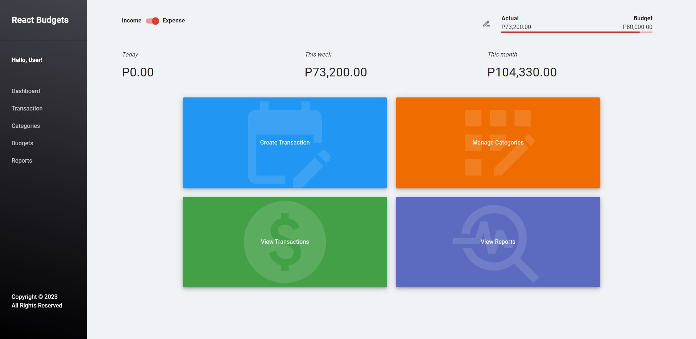

# react-budgets
A budget tracking app made from vanilla React. 

## Live Demo

Play around with the app here! https://react-budgets-web.vercel.app/

For demo purposes, a different branch was deployed at Vercel which utilizes `localStorage` for an easy storage solution per user.

## Preview

## Features

* Log expenses (or transactions) and keep track of your spending/earnings on a daily, weekly, and monthly basis
* Set your own budgets
* A progress bar to indicate your actual spending vs. your set budget
* Manage your own categories in which transactions can be associated with
* View a trail of all transactions grouped by day
* Search transactions functionality
* Filtering functionality
* Edit/Delete logged transactions

## Local Installation

1. Make sure you have Node.js installed on your local machine
2. Clone this repo 
3. Navigate to the created folder via terminal and run `npm i`
6. Afterwards, run `npm run dev` until the server listens at port 3000
7. Go to your browser and type in http://localhost:3000/
8. Happy coding!

## Few points

* Transactions can be either be 'expense' or 'income'
* Currency is set to Philippine Peso by default for now

## TO-DOs

* Form validations
* Reports section
* Paginations
* Currency customization
